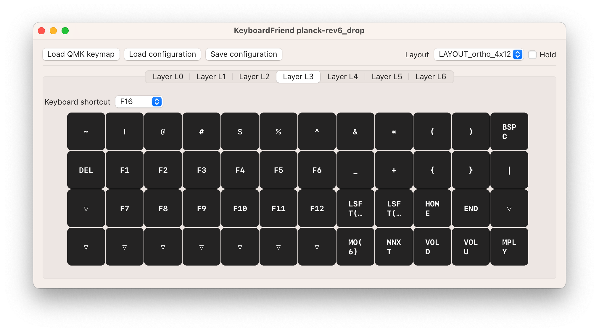

# KeyboardFriend
## A tool to help you find your way around your new keyboard's many layers

🚧 This is yanky alpha software! 🚧

  

This is a simple little application for macOs that can show you an overlay of a layer on your keyboard.

You give it your QMK json layout, and it allows you to set a hotkey (F16-F20) for a layer.
Holding down that hotkey will display an overlay, that does not steal focus, of the current layer.

  

  

