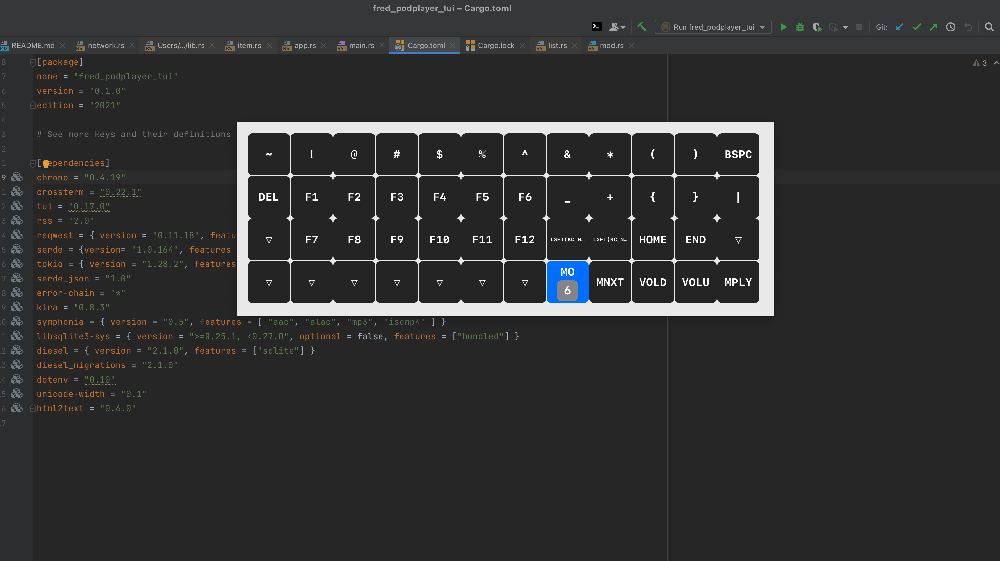

# KeyboardFriend
## A tool to help you find your way around your new keyboard's many layers

  

You just bought one of those small form factor keyboards thinking you are going to be hot shit, using a ton of layers to get to all numbers, symbols, macros etc.

Well, the first time using one can be really tricky. "Now where did I actually put left bracket?" you are thinking while your product manager is screaming at you to fix that bug you should have fixed 3 hours ago.

You could of course print out a paper with all your layer layouts, but that means interacting with a modern printer which is aneurysm inducing, and you long ago abandoned having one at home.

This is a simple little application for macOS that can show you an overlay of a layer on your keyboard.

You give it your QMK json layout, and it allows you to set a hotkey for a layer.
Tapping down that hotkey will display an overlay (that does not steal focus) of the current layer. Tap it again to hide!

  

  

